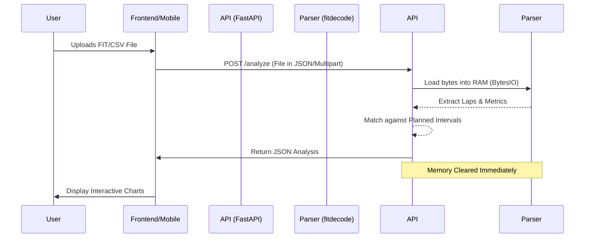
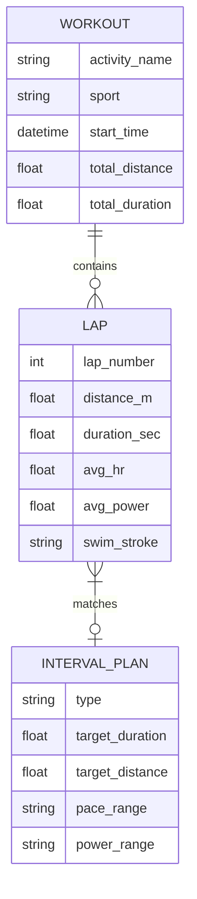

# ⏱️ Interval Matcher

[](https://fastapi.tiangolo.com/)
[](https://nextjs.org/)
[](https://flutter.dev/)
[](https://www.docker.com/)

**Interval Matcher** is a privacy-first workout analysis suite designed for athletes. It allows you to compare your planned workout intervals (from [intervals.icu](https://intervals.icu)) with actual execution data from FIT files, without ever storing your personal data on a server.

---

## 🏗️ Architecture: The Ephemeral Pipeline

Interval Matcher is built with a **Zero-Persistence** philosophy. Your workout data is processed entirely in RAM and returned to you instantly. No databases, no disk writes, no tracking.

### Data Flow Diagram



---

## 📊 Core Data Relationships

Even though the system is stateless (stateless RDB style), we maintain a strict schema for high-precision analysis:



---

## 🌟 Key Features

-   **Multi-Sport Support**: Precision analysis for Running (Pace/GCT), Cycling (Power), and Swimming (Stroke/SWOLF).
-   **True Ephemeral Processing**: Zero data stored. All analysis happens in memory.
-   **Smart Plan Matching**: Paste your `intervals.icu` workout plan and see how well you hit your targets.
-   **Interactive Visualizations**: Beautiful charts for HR, Pace, Power, and Cadence.
-   **Privacy-First**: No accounts, no cookies, no database.

---

## 🛠️ Technology Stack

### Backend (Python/FastAPI)
- **FastAPI**: High-performance asynchronous API framework.
- **fitdecode/fitparse**: Advanced FIT file binary parsing.
- **SlowAPI**: Token-bucket rate limiting for API protection.
- **Pytest**: Comprehensive test suite for analysis logic.

### Frontend (TypeScript/Next.js)
- **Next.js 15**: Modern React framework with App Router.
- **Tailwind CSS**: Utility-first styling with a premium design system.
- **Recharts**: Responsive SVG-based charting.
- **Lucide React**: Beautiful, consistent iconography.

### Mobile (Dart/Flutter)
- **Flutter**: Cross-platform mobile app for iOS and Android.
- **Provider**: Clean state management.
- **Syncfusion Charts**: High-performance mobile data visualization.

---

## 🚀 Quick Start

### 📦 Docker (Recommended)
```bash
docker build -t interval-matcher .
docker run -p 8001:8001 interval-matcher
```

### 🐍 Local Backend
```bash
python3 -m venv venv
source venv/bin/activate
pip install -r requirements.txt
python3 -m uvicorn api:app --reload --port 8001
```

### ⚛️ Local Frontend
```bash
cd frontend
npm install
npm run dev
```

### 📱 Local Mobile
```bash
cd mobile
flutter pub get
flutter run
```

---

## 🔒 Security & Privacy
- **Statelessness**: The API does not have a database connection.
- **Encryption**: TLS 1.3 is enforced for all transmissions.
- **Rate Limiting**: Tiered access ensures service availability.

---

## 🤝 Contributing
Contributions are welcome! Please check the `FEATURES.md` for the technical roadmap.

## 📄 License
MIT License - Copyright (c) 2026 Interval Matcher Team
